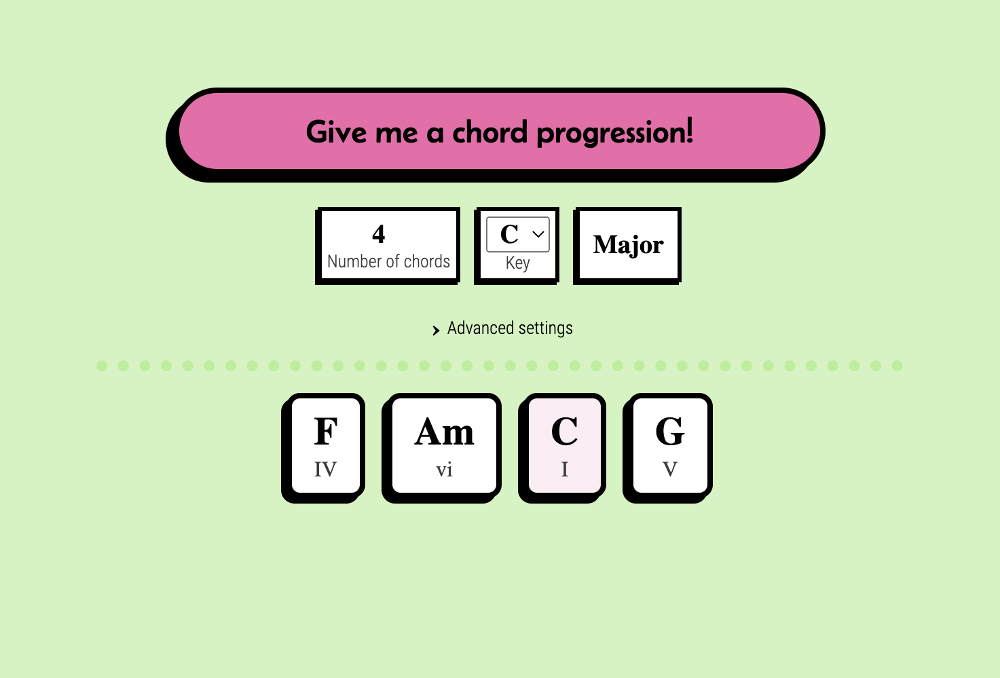
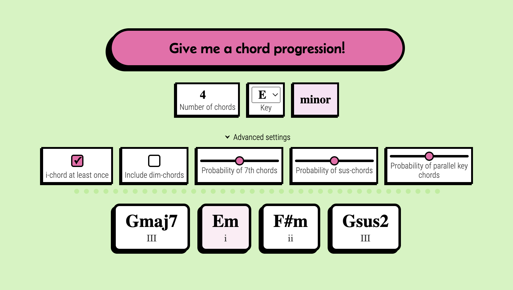

# Give Me A Chord Progression

This is a React and Express powered web application that generates random chord progressions based on certain constraints.

[Try it here!](https://fredrikgson-givemeachordprogression.netlify.app/)
**Important note:** *The deployed version that can be accessed via this link is a rewritten static version of the app. I did this to be able to provide an interactive demonstration without having to host a server. The static version looks and feels exactly the same as the full stack app.*

### App funcitonality
At the center of attention, there is a large “Give me a chord progression!” button. When clicked, it will generate a random chord progression based on the specified criteria (4 chords in the key of C Major by default). The user may change these settings to generate between 2 to 8 chords in any key they like.

Additionally, the user may tweak the advanced settings to spice up the chords.

**One-chord at least once:** Forces the one-chord to appear at least once in the progression. This is checked by default, and recommended, as many progressions will start to sound like they’re in a different key if there is no one-chord.

**Include dim-chords:** Whether or not diminished chords will be included. If unchecked (as it is by default), no diminished chords will be generated.

**Probability of 7th chords:** The likelihood of each chord being a 7th chord. Ranges between 0% and 100%. If set to 0% (all the way left), no chords will be 7th chords. If set to 100% (all the way right), all chords will be 7th chords. If set to 50%, each chord has a 50% chance of being a 7th chord.

**Probability of sus-chords:** The likelihood of each chord being a sus4 or sus2 chord. Ranges between 0% and 100%. If a chord is decided to be a sus-chord, it is randomly chosen to be a sus4 or sus2 chord.

**Probability of parallel key chords:** The likelihood of each chord being borrowed from the parallel minor/major key. Ranges between 0% and 50%, as it wouldn’t make sense for all chords in a progression to be borrowed from the parallel key.

By tweaking these advanced settings, some seriously crazy results can be generated.

### Technical specifications
The frontend is built using React and JavaScript. It pretty much consists of a simple form that requests a chord progression from the server, and passes the criteria as query parameters. The UI style is intended to mimic the neo-brutalism design style, and is written in pure CSS.

The server is built using NodeJS and Express. It contains modules that generate and map chord progressions to a given key. The API has only two endpoints, one that sends a list of all keys (which is needed for the *Key* dropdown menu in the UI), and one that sends a chord progression.

### Developer reflection
The idea of an app that generates chord progressions is something I’ve experimented with [before](https://youtu.be/Pj6JNkYeW0Y). This project is meant to be a more fleshed out version of that, using technologies that I have since learned.

### Preview
<figure>
    
    <figcaption>Generated chords</figcaption>
  </figure>
  

  <figure>
    
    <figcaption>Generated chords with advanced tweaks</figcaption>
  </figure>
